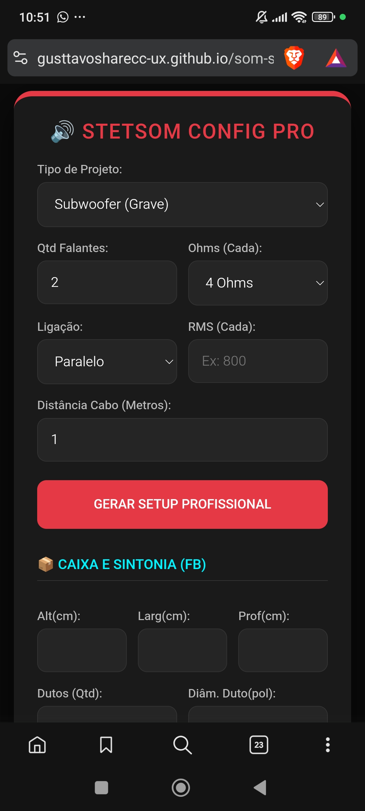

# 🔊 Stetsom Config Pro

**Desenvolvido por Gustavo Defalt**

Uma ferramenta técnica profissional e gratuita voltada para instaladores de som automotivo. O objetivo deste projeto é facilitar cálculos complexos do dia a dia, garantindo a integridade dos equipamentos e a máxima performance sonora.

---

## 🚀 Funcionalidades Principais

- **Cálculo de Limiter (Vrms/dBu):** Proteja seus alto-falantes configurando o ganho correto no processador.
- **Simulador de Impedância:** Cálculo automático para ligações em Série e Paralelo.
- **Litragem de Caixas:** Calculadora de volume bruto em litros para projetos acústicos.
- **Sintonia de Duto (Fb):** Estimativa da frequência de sintonia para graves perfeitos.
- **Dimensionamento de Cabos:** Sugestão de bitola (mm²) baseada na potência e distância da bateria.
- **Dicas de Proteção:** Avisos inteligentes para Drivers e Super Tweeters.

---

## 🛠️ Tecnologias Utilizadas

Este projeto foi desenvolvido focado em performance mobile e acessibilidade:

* **HTML5 & CSS3:** Interface moderna com tema Dark e design responsivo.
* **JavaScript (Vanilla):** Lógica de cálculos matemáticos sem dependências externas.
* **Google Analytics:** Monitoramento de métricas e comportamento do usuário.
* **Termux:** Ambiente de desenvolvimento utilizado para codificação e testes.

---

## 📈 Como usar?

1. Acesse o site pelo link oficial do projeto.
2. Insira os dados técnicos do seu alto-falante e módulo.
3. Clique em **"Gerar Setup Profissional"**.
4. Use o botão de **Compartilhar** para enviar o relatório para seu cliente via WhatsApp.

---

## 📬 Contato Profissional

Se você gostou deste projeto ou precisa de uma automação/site personalizado, entre em contato:

* **Desenvolvedor:** Gustavo Defalt
* **WhatsApp:** [Clique aqui para falar comigo](https://wa.me/5533984531746?text=Olá%20Gustavo,%20vi%20seu%20projeto%20no%20GitHub!)
